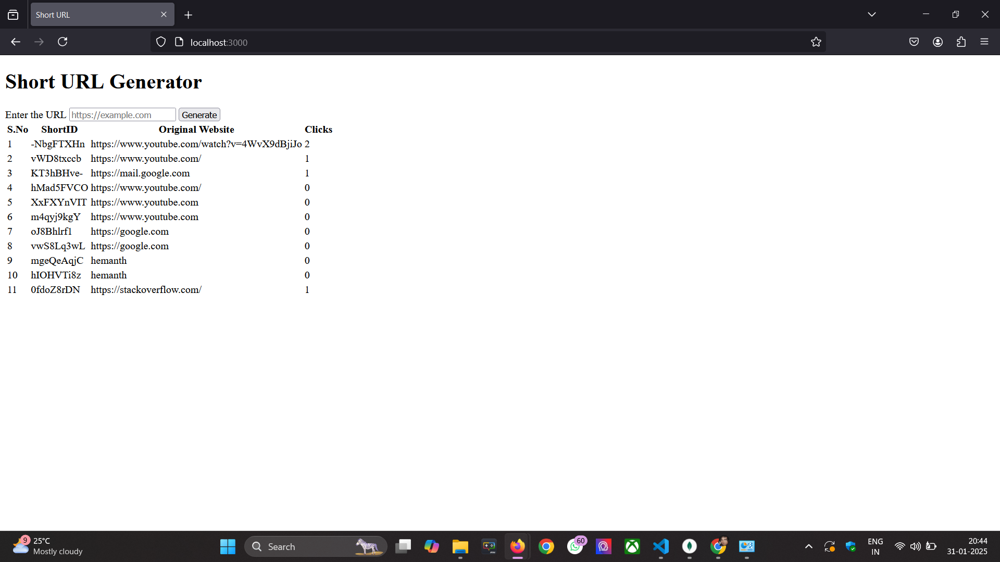

```markdown
# Short URL Generator

A simple URL shortener built with Node.js, Express, and MongoDB.

## Features

- **Short URL Generation:** Create a shortened URL for any long URL.
- **Redirection:** Redirect from a short URL to the original long URL.
- **Click Tracking:** Logs the timestamp of every click.

## Requirements

- **Node.js:** v14 or later
- **MongoDB:** Running locally on port 27017

## Installation

1. **Clone the Repository:**
   ```bash
   git clone https://github.com/yourusername/your-repo.git
   ```

2. **Navigate to the Project Directory:**
   ```bash
   cd your-repo
   ```

3. **Install Dependencies:**
   ```bash
   npm install
   ```

## Configuration

- The project connects to MongoDB at `mongodb://127.0.0.1:27017/short-url`.  
  If you need to change the database connection string, update it in `index.js`.

## Running the Project

Start the server with:
```bash
node index.js
```
The server will run on `http://localhost:3000`.

## How It Works

1. **Generate a Short URL:**
   - Visit `http://localhost:3000/` to access the main page.
   - Enter the long URL in the form and click **Generate**.
   - A short URL is created, stored in MongoDB, and displayed on the page.

2. **Redirection:**
   - When you navigate to a generated short URL (e.g., `http://localhost:3000/url/:shortUrl`), the server:
     - Finds the corresponding long URL in the database.
     - Logs the click timestamp.
     - Redirects your browser to the original URL.

3. **Click Tracking:**
   - Each redirection logs a timestamp in the MongoDB document for that URL.

## Project Structure

```
├── controllers
│   └── control.js
├── models
│   └── Schema.js
├── routers
│   ├── router.js
│   └── staticRouter.js
├── views
│   └── shorturl.ejs
└── index.js
```

## Dependencies

- [Express](https://expressjs.com/)
- [Mongoose](https://mongoosejs.com/)
- [EJS](https://ejs.co/)
- [shortid](https://www.npmjs.com/package/shortid)


